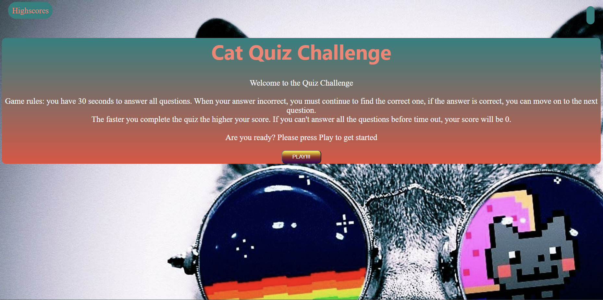
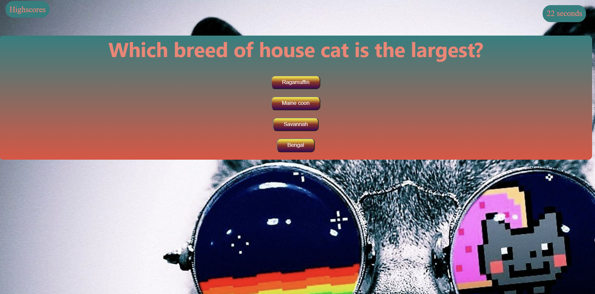
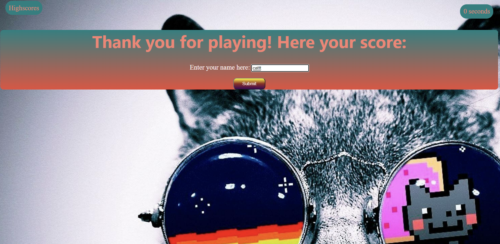

Press PLAY to start

The clock starts to count down

Choose the correct answer. If false nothing happens, if correct automatically move the next questions

The faster you complete the quiz, the higher the score. If not finish before the time out, count 0 points.

Complete the quiz, user input appears

Input name, click submit , the data will automatically save and open the scoreboard

Click clear to clear the scoreboard, click restart to return to the first page.

